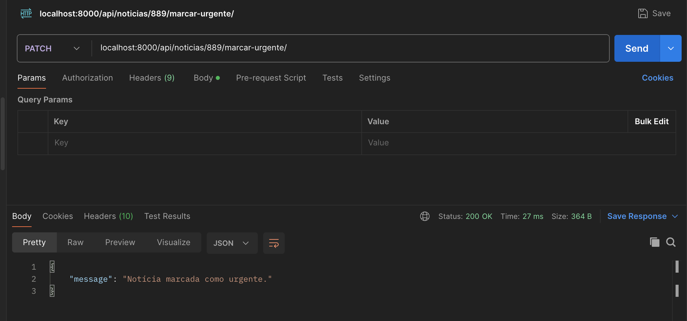
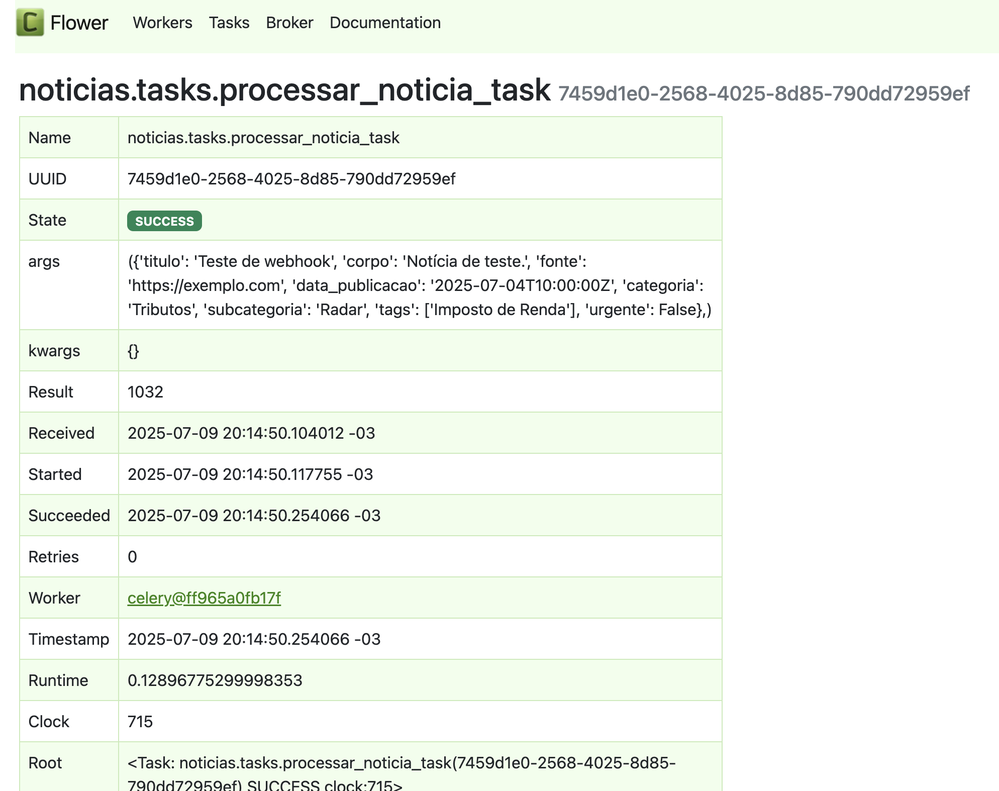

# Evidências Visuais

Este documento reúne prints que demonstram o funcionamento completo do sistema.

---

## Segurança no Webhook (Postman)

- ✅ Rejeição sem token  
  

- ✅ Aceitação com token  
  

---

## Webhook: inserção e classificação

- ✅ marcar notícia  como urgente
  

- ✅ Filtro por categoria  e urgencia
  

- ✅ Filtro por tag  
  

- ✅ Listagem de tags  
  

---

## Monitoramento com Flower

- Worker ativo  
  

- Tasks processadas  
  

- Detalhes de uma task  
  
  
- Broker 
  

---

## ⚙️ Swagger UI

- Endpoints documentados  
  

- Detalhes de um endpoint  
  

---

## ⚙️ Admin do Django

- Geral
  

- visao noticia
  

- Mapeamento de rotas  
  

---